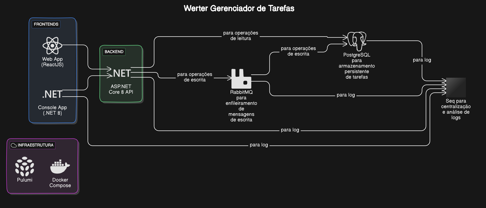

# App Registro de tarefa





## Regras e testes

Status:

1. **Pendente**: A tarefa foi criada, mas ainda não foi iniciada.
2. **Em Andamento**: A tarefa está atualmente sendo trabalhada.
3. **Concluída**: A tarefa foi finalizada.
4. **Atrasada**: A tarefa não foi concluída até a data de vencimento.
5. **Cancelada**: A tarefa foi cancelada e não será concluída.


- O que é necessário para o usuário registrar uma tarefa

  - descrição(obrigatório), data_vencimento(opcional) e status(opcional)

- O que é necessário para atualizar uma tarefa:

  - ID (obrigatório) e pelo menos um dos seguintes campos: descrição, data_vencimento ou status

- estrutura de dados

  - ```json
    {
      "id": "92020192-8b83-4951-a8f5-cf6031d9dbaf",
      "descricao": "Finalizar relatório",
      "data_criacao": "2024-08-13",
      "data_finalizacao": null,
      "data_vencimento": "2023-10-10",
      "status": "Pendente",
      "historico": [
        {
          "data_alteracao": "2024-08-13",
          "status_anterior": null,
          "novo_status": "Pendente",
          "data_anterior": null,
          "nova_data": "2024-08-13"
        }
      ]
    }
    ```


##### Cenário de testes

1. Registro da tarefa
   1. Quando o usuário preencher a **descrição** e o campo estiver em branco, deve exibir a mensagem "O campo descrição é um campo obrigatório". com status code 400.
   2. Quando o usuário preencher a **descrição** e o campo tiver mais de 100 caracteres, deve exibir a mensagem "O campo só permite 100 caracteres". com status code 400.
   3. Quando o usuário preencher somente o campo **descrição** e deixar a **data_vencimento** e o **status** em branco, o **status** deve ter o valor "Pendente" e apresentar a mensagem: "Tarefa registrada com sucesso". com status code 201.
   4. Quando o usuário preencher a **descrição**, **data_vencimento** em branco e o **status** for definido como "Em Andamento", deve apresentar a mensagem: "Tarefa registrada com sucesso" com status code 201.
   5. Quando o usuário preencher a **descrição**, **data_vencimento** com um valor antigo e o **status** for definido como Atrasada, deve apresentar a mensagem: "Tarefa registrada com sucesso" com status code 201.
   6. Quando o usuário preencher a **descrição**, **data_vencimento** com um valor antigo e o **status** for definido como "Cancelada" ou "Concluída", a Tarefa deve ter a **data_finalização** com esse valor e apresentar a mensagem: "Tarefa registrada com sucesso" com status code 201.
   7. Quando o usuário preencher a **descrição**, **data_vencimento** com um valor futuro e o **status** for definido como "Cancelada", deve apresentar a mensagem: "Não é possível registrar um tarefa cancelada com uma data futura" com status code 422. (a semântica da requisição é inválida)
   8. Quando o usuário preencher a **descrição** e a **data_vencimento** inválida, deve apresentar a mensagem: "A data informada é inválida" com status code 400.
   9. Quando o usuário preencher a **descrição**, com a **data_vencimento** sem valor e o **status** ["Concluída" ou "Cancelada"], a **data_vencimento** deve ser preenchida com o a data atual e deve apresentar a mensagem: "Tarefa registrada com sucesso" com status code 201.
   10. Quando o usuário preencher a **descrição**, com a **data_vencimento** sem valor e o **status** Atrasada, a **data_vencimento** deve ser preenchida com o a data atual e deve apresentar a mensagem: "Tarefa registrada com sucesso" com status code 201.
2. Atualização da tarefa
   1. Quando for fornecido um **ID** de uma tarefa que não existe, deve apresentar a mensagem: "A tarefa informada não existe" com status code 404
   2. Para uma tarefa que existe e campo **descrição** foi atualizado com um valor em branco, deve apresentar a mensagem: "O campo descrição é um campo obrigatório" com status code 400
   3. Para uma tarefa que existe e a **descrição** tiver mais de 100 caracteres, deve exibir a mensagem **"O campo só permite 100 caracteres"**. com status code 400.
   4. Para uma tarefa que existe com o **status** "Pendente" e for alterado para "Em Andamento", e a data estiver em branco, deve atualizar o status para "Em Andamento", preencher o histórico com essa atualização e deve apresentar a seguinte mensagem: "Tarefa atualizada com sucesso." com status code 200
   5. Para uma tarefa que existe com o **status** "Pendente" e for alterado para ["Concluída", "Atrasada" ou "Cancelada"] e a **data_vencimento** fornecida é anterior à "**data_vencimento**" do último registro, preencher o histórico com essa atualização e deve apresentar a seguinte mensagem: "Tarefa atualizada com sucesso." com status code 200
   6. Para uma tarefa que existe com o **status** "Em Andamento" e for alterado para ["Pendente", "Concluída", "Atrasada" ou "Cancelada"] e a data fornecida é maior que a data do último registro, preencher o histórico com essa atualização e deve apresentar a seguinte mensagem: "Tarefa atualizada com sucesso." com status code 200
3. Excluir tarefa
   1. Quando for fornecido um **ID** de uma tarefa que não existe, deve apresentar a mensagem: "A tarefa informada não existe" com status code 404
   2. Ao tentar excluir uma tarefa que existe, deve apresentar a mensagem: "Tarefa deletada com sucesso" com status code 200. (Pois eu retorno a mensagem com o status)


## Pré-requisitos

Antes de iniciar, certifique-se de ter as seguintes ferramentas instaladas:

- .NET SDK `8.0.204`
- Docker `26.0.1`
- Docker Compose `v2.26.1`


## Bibliotecas Utilizadas

- `Ardalis.GuardClauses`: Garante pré-condições nos métodos.
- `FluentResults`: Fornece uma maneira de retornar resultados ou erros.
- `FluentValidation`: Permite a criação de regras de validação.
- `JetBrains.Annotations`: Fornece anotações de código para melhorar a análise estática.
- `Mapster`: Mapeamento de objetos.
- `MediatR`: Implementação do padrão Mediator para desacoplamento.
- `RabbitMQ.Client`: Cliente AMQP para interagir com RabbitMQ.
- `Serilog`: Logging.
- `Serilog.Sinks.Seq`: Sink do Serilog para o Seq.
- `Carter`: Biblioteca para roteamento e vinculação de solicitações HTTP.
- `Spectre.Console`: facilita a criação de interfaces de usuário interativas e ricas em aplicativos de console. 


## Testes Unitários

Bibliotecas utilizadas para testes unitários:

- `FakeItEasy`: Criação de objetos falsos para testes.
- `FluentAssertions`: Assertivas fluentes para testes.
- `xunit`: Framework de testes.


## Ferramentas Utilizadas

- Typora
- Rider no Linux PopOs I3wm
- VsCode 
- Visual Studio No Windows
- app.eraser.io


## Teste das APIs

As APIs podem ser testadas através de:

- Arquivos .http: dentro do proprio diretorio do endpoint
  - tarefas.http
- Postman: arquivos json estão aqui no respositorio
  - collections.json env.json
- Cliente Web através de um arquivo HTML estático: https://locahost:7000/api.html

| API        | Endpoint                      | Docker |
| ---------- | ----------------------------- | ------ |
| Tarefas    | https://locahost:7000/tarefas | 8000   |
|            |                               |        |
| UI RabbiMQ | Localhost:15672               |        |
| UI Seq     | Localhost:5341                |        |
| Postgres   | localhost:                    |        |

